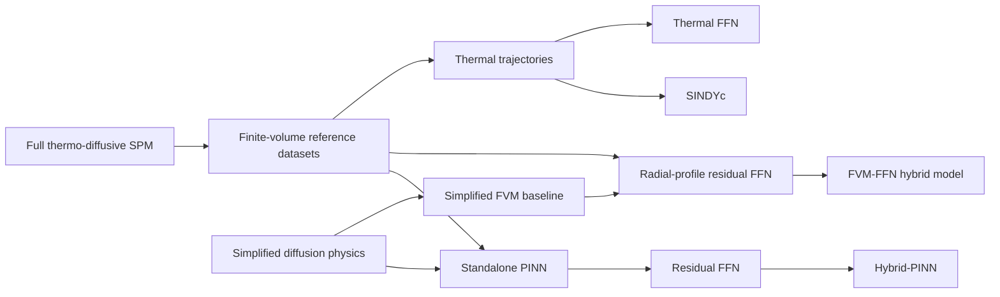

# Hybrid Modelling for Lithium Diffusion in a Spherical Particle

This repository investigates physics-based, physics-informed, and hybrid
machine-learning approaches for lithium diffusion inside a spherical active
material particle. The project uses a thermo-diffusive Single Particle Model
(SPM) as a high-fidelity reference and studies how simplified physics can be
combined with data-driven corrections.

The software covers four connected modelling tasks:

- a conservative finite-volume reference model with state-dependent solid
  diffusivity and lumped thermal dynamics;
- a Physics-Informed Neural Network (PINN) constrained by a simplified,
  constant-diffusivity equation;
- post-training residual correction of a frozen PINN through a feedforward
  neural network (Hybrid-PINN);
- residual correction of a simplified finite-volume model and identification
  of the thermal dynamics using either SINDYc or a feedforward neural network.

The main objective is not only to reduce prediction error, but also to compare
accuracy, physical consistency, computational cost, generalization, and model
interpretability across the different approaches.

> **Full documentation:** [open the complete technical report](./Hybrid_PINN_for_SPM.pdf).

## Modelling workflow



The two hybrid concentration models serve different purposes:

- **Hybrid-PINN:** corrects the output of an already trained and frozen PINN at
  each space--time coordinate.
- **FVM--FFN hybrid:** predicts an entire radial discrepancy profile from
  simplified-model state quantities such as average concentration, surface
  concentration, and applied current.

The FVM--FFN correction is projected onto the affine set of profiles with a
constant spherical volume average,

\[
\overline{\Delta C}_{\phi}(\tau)=b.
\]

The offset `b` is estimated from the training residuals and stored in the
checkpoint. The hard projection is applied during training, validation, and
testing, so the correction cannot introduce a temporal drift in lithium
inventory. This constraint preserves the mass evolution of the conservative
simplified baseline while still allowing a non-zero initial inventory offset.

## Repository structure

```text
Software_V2/
├── Hybrid_PINN_for_SPM.pdf          # Complete technical report
├── Single_Particle_Model_V3/        # Full and simplified FVM particle models
│   ├── Config.py                    # Command-line physical/numerical settings
│   ├── ModelGeneration.py           # Geometry, diffusivity, thermal law, flux
│   ├── Assembler.py                 # Conservative finite-volume equations
│   ├── ParticleSimulation.py        # Coupled simulation orchestration
│   ├── DatasetGenerator.py          # Checks, derived quantities, CSV export
│   ├── Visualizer.py                # Concentration/temperature diagnostics
│   ├── Demo.py                      # Main simulation and dataset entry point
│   ├── ConvergenceTest.py           # Radial mesh-convergence study
│   ├── SPMDataset/                  # Generated reference/training datasets
│   └── Images/                      # FVM figures
│
├── PINN/                            # Simplified-physics PINN and Hybrid-PINN
│   ├── NeuralNetwork.py             # PINN, residual FFN, hybrid wrapper
│   ├── Generator.py                 # Data/collocation/boundary/residual loaders
│   ├── Processor.py                 # Adam and L-BFGS PINN training
│   ├── Tester.py                    # Held-out error and physics evaluation
│   ├── Visualizer.py                # Standalone PINN plots and comparisons
│   ├── PINNDemo.py                  # Standalone PINN training entry point
│   ├── ResidualLearning.py          # Residual training and physical checks
│   ├── HybridDemo.py                # Frozen-PINN correction pipeline
│   ├── HybridVisualizer.py          # Hybrid-PINN diagnostic plots
│   ├── PlotPINN.py                  # Plot from saved checkpoints
│   ├── Data/                        # PINN and corrected datasets
│   ├── Results/                     # Checkpoints and metric histories
│   └── Images/                      # PINN/Hybrid-PINN figures
│
├── Hybrid_Model/                    # FVM--FFN and thermal hybrid studies
│   ├── DatasetLoader.py             # Aligned profile datasets and splits
│   ├── NeuralNetwork.py             # Profile-correction and thermal FFNs
│   ├── Processor.py                 # Training with hard inventory projection
│   ├── Tester.py                    # Reconstruction and inventory diagnostics
│   ├── HybridDemo.py                # FVM--FFN hybrid training entry point
│   ├── Visualizer.py                # Corrected-field visualization
│   ├── PlotHybrid.py                # Plot a saved corrected dataset
│   ├── ThermalDiscover.py           # SINDyC/FFN identification and rollout
│   ├── TemperatureField.py          # Thermal model selection and comparison
│   ├── CompareMethods.py            # Cross-method concentration comparison
│   ├── ConvergenceTest.py           # Frozen-model robustness tests
│   ├── Dataset/                     # Baseline, reference, corrected, variants
│   ├── Results/                     # Training/test histories and checkpoints
│   └── Images/                      # Hybrid and thermal figures
│
└── Benchmark/                       # Reproducible multi-seed evaluation suite
    ├── run_benchmarks.py            # Benchmark orchestration and aggregation
    ├── worker.py                    # Isolated execution of each model/run
    ├── default_config.json          # Smoke, standard, and publication presets
    ├── effort_log_template.csv      # Human-effort input template
    ├── README.md                    # Protocol and interpretation guidance
    └── results/                     # Timestamped machine-readable outputs
```

Generated datasets, model checkpoints, metric histories, and figures are kept
next to the workflow that produces them. Most entry-point scripts therefore
expect to be launched from their own subdirectory.

## Representative results

### Full-physics finite-volume reference

The reference solver resolves the radial concentration field while coupling
solid diffusion to the lumped temperature state and the operating-current
profile.


### Post-training correction of the PINN

The frozen PINN supplies the physics-informed baseline. The residual network
learns the discrepancy with respect to the full FVM field, substantially
reducing the error without retraining the original PINN. Physical properties
not enforced by the residual architecture are evaluated separately through
mass-balance, bounds, boundary-flux, PDE, and regularity checks.


### Simplified-FVM residual correction

In the final publication benchmark (five seeds and two repeats per seed), the
simplified FVM obtains a mean full-field RMSE of `8.2082e-03` and a mean
relative L2 error of `1.1016e-02`. The FVM--FNN hybrid reduces these values to
`2.9637e-04` and `3.9776e-04`, respectively. Since the baseline and corrected
fields are evaluated as a paired pipeline in every run, this corresponds to a
mean nominal RMSE reduction of `96.39%`.

The hybrid mean maximum mass-balance residual is `4.4996e-05`, compared with
`4.5522e-05` for the simplified FVM, and no physical-bound violations are
detected. These checks show that the learned correction does not degrade the
monitored inventory behaviour of the conservative baseline under the nominal
conditions. They do not, by themselves, establish accuracy outside the
training domain.

The figure below is produced by the original single-checkpoint comparison.
It remains useful as a qualitative field-error visualization; the aggregated
publication values reported above are the quantitative reference for the
final model comparison.


The comparison with the standalone PINN must be interpreted with care. In the
current experiment, the reference FVM, simplified FVM, and FVM--FFN hybrid use
the variable operating-current profile, whereas the saved standalone PINN was
trained with its prescribed constant-flux formulation. The plot is therefore
a comparison of the current implementations on the same reference field, not
a universal ranking under identical physical assumptions.

### Robustness to baseline perturbations

`ConvergenceTest.py` and the benchmark worker evaluate a frozen nominal
checkpoint on five simplified-model variants spanning different initial
concentrations and dimensionless final times associated with the perturbed
baselines. The correction improves the simplified-model RMSE for two variants
(`9.40%` and `11.60%`) but worsens it for the remaining three (`-220.12%`,
`-58.26%`, and `-34.00%`). No physical-bound violations are detected.

This is an applicability-domain result rather than a stochastic-training
result: the same nominal correction is reused without retraining. It shows
that inventory consistency and nominal accuracy do not guarantee predictive
robustness under trajectory or parameter changes. A deployed corrector
therefore needs an applicability check, a retraining policy, or a fallback to
the physical solver.

The figure below visualizes the original frozen-checkpoint experiment. The
percentages reported above are the multi-seed publication aggregates and
supersede the single-run values for final reporting.


### Thermal model identification

SINDYc and the thermal FFN are trained on multiple operating trajectories and
tested on dedicated interpolation and extrapolation cases. Their comparison
includes temperature and derivative errors, rollout stability, training and
inference time, and model complexity.

In the publication benchmark, SINDYc identifies a two-term thermal model with
interpolation and extrapolation RMSE values of `3.3981e-04 K` and
`4.9426e-04 K`. The thermal FFN obtains `3.808e-03 K` and `6.5494e-02 K`,
respectively, and is also slower to train and roll out in this implementation.
This result reflects the fact that the tested thermal dynamics are sparse in
the selected candidate library; it is not a general claim that SINDYc always
outperforms neural models.

The following plot is an illustrative trajectory-level comparison; the
publication statistics above provide the aggregated quantitative result.


## Typical execution order

The scripts currently use local relative paths, so enter the corresponding
folder before running them.

```bash
# 1. Generate/reference the finite-volume simulations and datasets
cd Single_Particle_Model_V3
python Demo.py

# 2. Train and evaluate the standalone PINN
cd ../PINN
python PINNDemo.py

# 3. Train the post-processing residual correction of the frozen PINN
python HybridDemo.py

# 4. Regenerate PINN or Hybrid-PINN figures from saved checkpoints
python PlotPINN.py --mode all

# 5. Train the simplified-FVM radial-profile correction
cd ../Hybrid_Model
python HybridDemo.py

# 6. Regenerate the FVM--FFN hybrid-only figures
python PlotHybrid.py

# 7. Test the frozen checkpoint across C0/Ds variants
python ConvergenceTest.py

# 8. Compare the reference, simplified, PINN, and FVM--FFN solutions
python CompareMethods.py

# 9. Compare SINDYc and the thermal FFN
python TemperatureField.py
```

The main experiment controls are currently defined in `Config.py` or near the
top of the relevant demo script. In particular, `TemperatureField.py` exposes
manual controls for the selected model (`SINDYC`, `FFN`, or `COMPARISON`) and
for interpolation versus extrapolation testing.

## Operational calibration of the simplified baseline

When only experimental concentration profiles are available, the reference
initial concentration does not have to be known independently. The simplified
model parameters can instead be treated as calibration candidates:

1. generate inexpensive simplified trajectories for candidate pairs
   `(C0, Ds)`;
2. align each trajectory with the experimental observation times;
3. pre-screen the candidates using observable concentration quantities;
4. retrain the residual model only for the most promising candidates;
5. estimate the corresponding constant offset `b` from the training residuals.

The selected `C0` should be interpreted as an effective initialization for the
observed time window when the first measurement is not the true physical
initial state. A new high-fidelity simulation is not required for every
candidate because the fixed experimental dataset supplies the residual target.
However, a residual model trained for one simplified baseline should not be
assumed to generalize to a materially different `(C0, Ds)` pair without
retraining or a separate parametric training design.

For the recorded nominal configuration (`C0 = 0.50`, `Ds = 1.75e-14`, 101
radial nodes, and 201 stored times), one warm-cache simplified dataset required
approximately `0.59 s`. Full hybrid training required `80.13 s` on MPS, with
early stopping at epoch 4893 and the best checkpoint at epoch 4093. In this
experiment, one complete retraining therefore cost roughly 136 simplified
dataset generations, which motivates candidate pre-screening before training.

## Main Python dependencies

The implementation uses Python 3.11 with:

- NumPy, pandas, SciPy, and scikit-learn;
- PyTorch;
- Matplotlib;
- PySINDy.

Dataset generation and full training can be computationally expensive. Saved
datasets and checkpoints allow plotting and post-processing to be repeated
without retraining every model.

## Automated reproducible benchmarks

The [`Benchmark`](Benchmark/) package executes the reference FVM, simplified
FVM, PINN, Hybrid-PINN, FVM--FNN, SINDYc, and thermal FFN through one common
measurement protocol. It supports independent seeds and repeated processes,
synchronized accelerator timings, physical and accuracy diagnostics, frozen
model robustness tests, statistical aggregation, dataset hashes, compute-only
break-even estimates, and an optional manually recorded engineering-effort
log.

Start with the short integration check:

```bash
cd Benchmark
python run_benchmarks.py --preset smoke
```

The `standard` and `publication` presets use production-scale training
settings and can require substantial computation. The publication preset is
the more exhaustive protocol: five seeds, two process-level repeats per seed,
and expanded timing repetitions. See
[`Benchmark/README.md`](Benchmark/README.md) before starting either run.

### Final publication benchmark

The finalized run `20260903_085820` completed all 70 requested executions:
seven pipelines, five independent initialization seeds, and two fresh-process
repeats per seed. The following values are run-level means on the tested Apple
Silicon system.

| Concentration pipeline | Relative L2 error | Online latency | Speedup vs reference | Offline training | Physical interpretation |
|---|---:|---:|---:|---:|---|
| Reference FVM | N/A | `108.679 ms` | `1.00x` | none | Numerical target and fallback |
| Simplified FVM | `1.1016e-02` | `80.767 ms` | `1.35x` | none | Passes mass and bound checks |
| FVM--FNN hybrid | `3.9776e-04` | `83.793 ms` | `1.30x` | `11.797 s` | Passes mass and bound checks on the nominal case |
| Standalone PINN | `5.1941e-02` | `4.648 ms` | `23.38x` | `590.203 s` | Fails the selected mass tolerance; some bound violations |
| Hybrid-PINN | `1.6655e-03` | `7.031 ms` | `15.46x` | `121.328 s` | No bound violations, but fails the selected mass tolerance |

All field errors in this table are measured against the reference-FVM
dataset. An error for the reference itself is therefore not an independent
accuracy measurement: the computed value of order `1e-14` only reflects
floating-point round-off and data-storage precision. It is intentionally
reported as not applicable here and must not be interpreted as physical or
experimental validation.

The FVM--FNN training cost is recovered after approximately 474 calls when
compared only with the measured online saving relative to the reference FVM.
The corresponding Hybrid-PINN correction-stage estimate is approximately
1,194 calls and excludes the earlier cost of producing its frozen PINN
checkpoint. These are compute-only break-even values: reference-data
generation, engineering effort, validation, and maintenance are excluded.

The timing comparison describes the complete implemented pipelines on the
benchmark machine. FVM-based workloads ran on CPU, whereas the PINN-based
workloads ran on Apple MPS. The values are therefore deployment measurements
for that configuration, not hardware-neutral rankings of the algorithms.

### Operational conclusions

- Use the **reference FVM** for qualification, low-volume high-assurance
  simulations, out-of-domain cases, and fallback.
- Use the **simplified FVM** when a training-free and physically consistent
  approximation is preferred and an error of order `1e-2` is acceptable.
- Use the **FVM--FNN hybrid** for high nominal accuracy when roughly `84 ms`
  is fast enough and an applicability-domain check is available.
- Use the **Hybrid-PINN** when sub-`10 ms` latency is required and conservation
  monitoring plus a physical fallback can be provided.
- Treat the present **standalone PINN** as a fast research baseline rather
  than the default reliability-critical solver.
- Use **thermal SINDyC** while the dynamics remain sparse in the selected
  candidate library; re-identify the model when the physics or excitation
  regime changes.

The recorded engineering effort is 152 person-hours (19 eight-hour days).
Problem definition, validation, and documentation account for 101 hours, or
66.4% of the total, while recorded training supervision accounts for 3 hours.
The dominant industrial cost is therefore formulation and qualification, not
optimizer runtime alone.

## Report

The mathematical formulation, numerical discretization, training procedures,
physical-consistency diagnostics, and complete quantitative comparisons are
available in the [full project report](./Hybrid_PINN_for_SPM.pdf).
