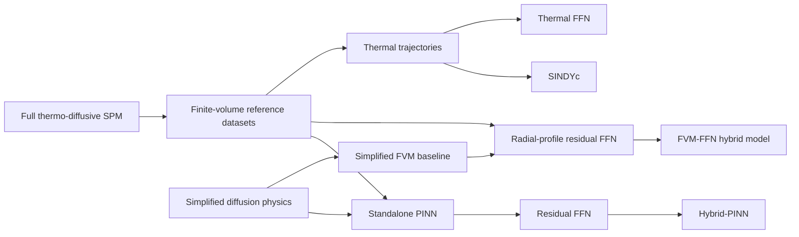
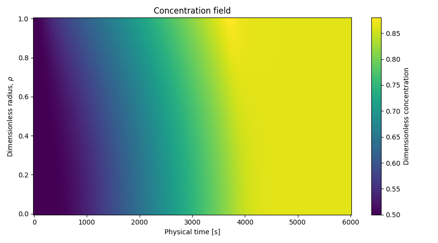
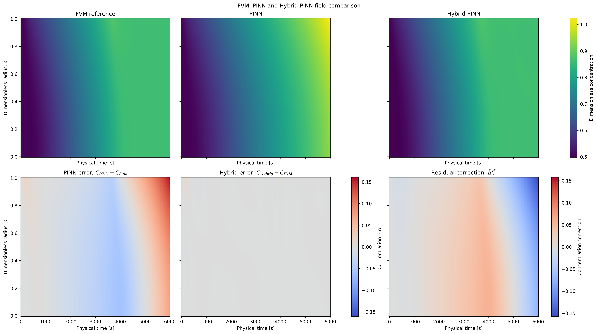
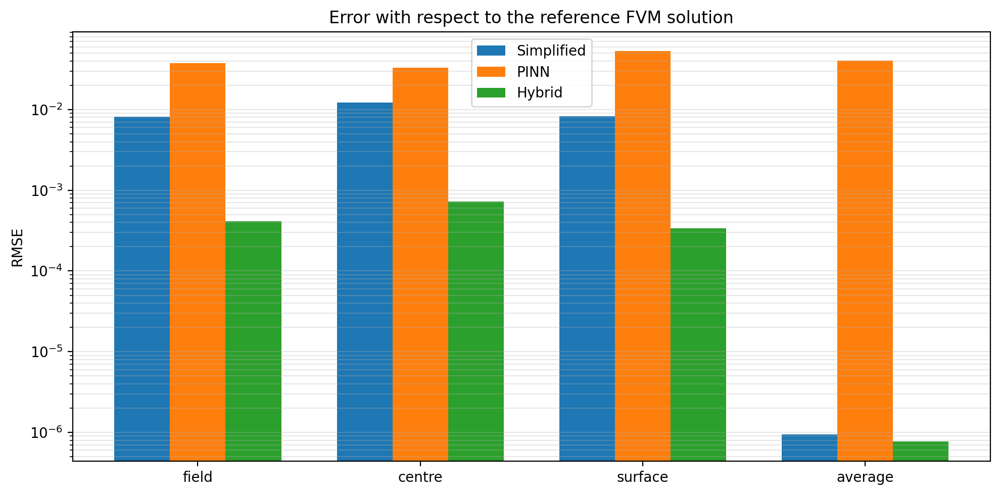
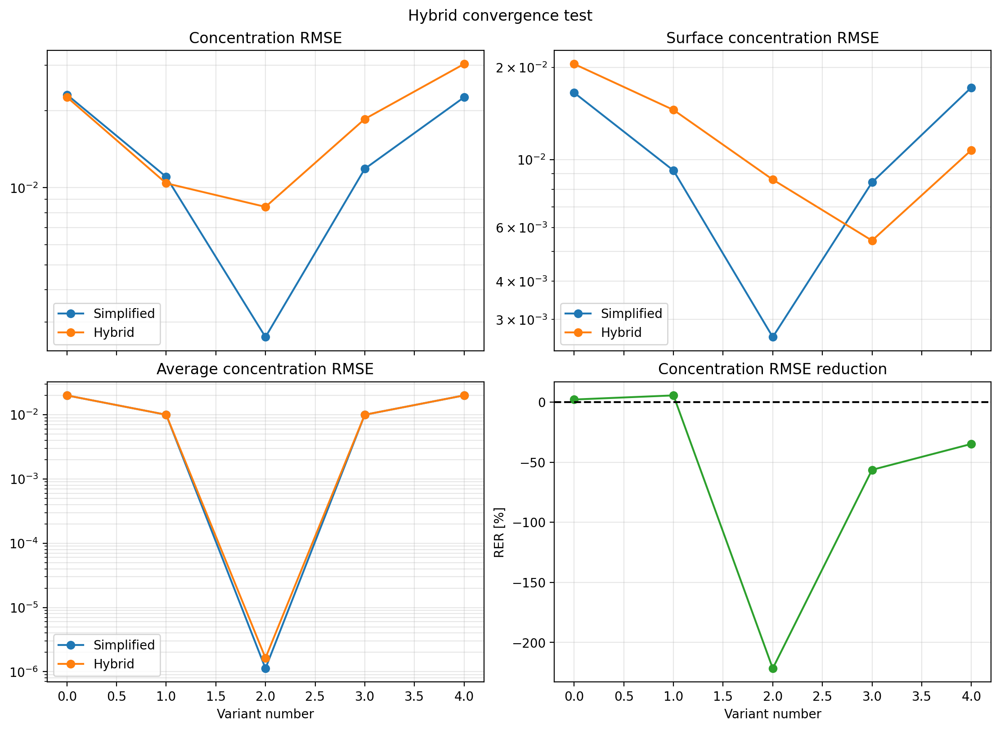
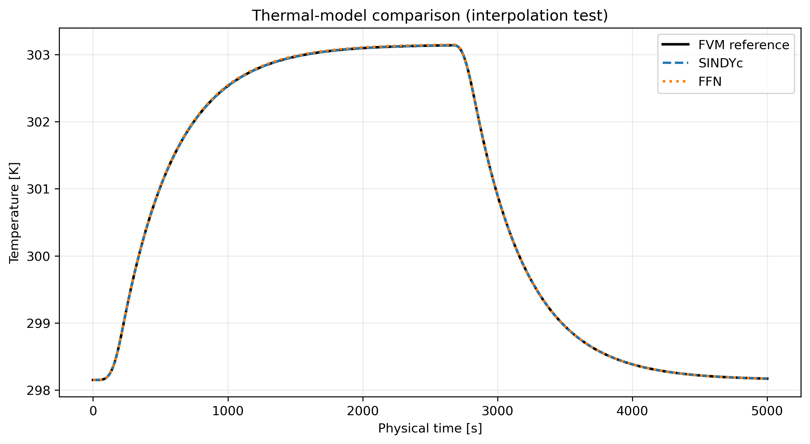

# Hybrid Modelling for Lithium Diffusion in a Spherical Particle

This repository investigates physics-based, physics-informed, and hybrid
machine-learning approaches for lithium diffusion inside a spherical active
material particle. The project uses a thermo-diffusive Single Particle Model
(SPM) as a high-fidelity reference and studies how simplified physics can be
combined with data-driven corrections.

The software covers four connected modelling tasks:

- a conservative finite-volume reference model with state-dependent solid
  diffusivity and lumped thermal dynamics;
- a Physics-Informed Neural Network (PINN) constrained by a simplified,
  constant-diffusivity equation;
- post-training residual correction of a frozen PINN through a feedforward
  neural network (Hybrid-PINN);
- residual correction of a simplified finite-volume model and identification
  of the thermal dynamics using either SINDYc or a feedforward neural network.

The main objective is not only to reduce prediction error, but also to compare
accuracy, physical consistency, computational cost, generalization, and model
interpretability across the different approaches.

> **Full documentation:** [open the complete technical report](./Hybrid_PINN_for_SPM.pdf).

## Modelling workflow



The two hybrid concentration models serve different purposes:

- **Hybrid-PINN:** corrects the output of an already trained and frozen PINN at
  each space--time coordinate.
- **FVM--FFN hybrid:** predicts an entire radial discrepancy profile from
  simplified-model state quantities such as average concentration, surface
  concentration, and applied current.

The FVM--FFN correction is projected onto the affine set of profiles with a
constant spherical volume average,

\[
\overline{\Delta C}_{\phi}(\tau)=b.
\]

The offset `b` is estimated from the training residuals and stored in the
checkpoint. The hard projection is applied during training, validation, and
testing, so the correction cannot introduce a temporal drift in lithium
inventory. This constraint preserves the mass evolution of the conservative
simplified baseline while still allowing a non-zero initial inventory offset.

## Repository structure

```text
Software/
├── Hybrid_PINN_for_SPM.pdf          # Complete technical report
├── Single_Particle_Model_V3/        # Full and simplified FVM particle models
│   ├── Config.py                    # Command-line physical/numerical settings
│   ├── ModelGeneration.py           # Geometry, diffusivity, thermal law, flux
│   ├── Assembler.py                 # Conservative finite-volume equations
│   ├── ParticleSimulation.py        # Coupled simulation orchestration
│   ├── DatasetGenerator.py          # Checks, derived quantities, CSV export
│   ├── Visualizer.py                # Concentration/temperature diagnostics
│   ├── Demo.py                      # Main simulation and dataset entry point
│   ├── ConvergenceTest.py           # Radial mesh-convergence study
│   ├── SPMDataset/                  # Generated reference/training datasets
│   └── Images/                      # FVM figures
│
├── PINN/                            # Simplified-physics PINN and Hybrid-PINN
│   ├── NeuralNetwork.py             # PINN, residual FFN, hybrid wrapper
│   ├── Generator.py                 # Data/collocation/boundary/residual loaders
│   ├── Processor.py                 # Adam and L-BFGS PINN training
│   ├── Tester.py                    # Held-out error and physics evaluation
│   ├── Visualizer.py                # Standalone PINN plots and comparisons
│   ├── PINNDemo.py                  # Standalone PINN training entry point
│   ├── ResidualLearning.py          # Residual training and physical checks
│   ├── HybridDemo.py                # Frozen-PINN correction pipeline
│   ├── HybridVisualizer.py          # Hybrid-PINN diagnostic plots
│   ├── PlotPINN.py                  # Plot from saved checkpoints
│   ├── Data/                        # PINN and corrected datasets
│   ├── Results/                     # Checkpoints and metric histories
│   └── Images/                      # PINN/Hybrid-PINN figures
│
└── Hybrid_Model/                    # FVM--FFN and thermal hybrid studies
    ├── DatasetLoader.py             # Aligned profile datasets and splits
    ├── NeuralNetwork.py             # Profile-correction and thermal FFNs
    ├── Processor.py                 # Training with hard inventory projection
    ├── Tester.py                    # Reconstruction and inventory diagnostics
    ├── HybridDemo.py                # FVM--FFN hybrid training entry point
    ├── Visualizer.py                # Corrected-field visualization
    ├── PlotHybrid.py                # Plot a saved corrected dataset
    ├── ThermalDiscover.py           # SINDYc/FFN identification and rollout
    ├── TemperatureField.py          # Thermal model selection and comparison
    ├── CompareMethods.py            # Cross-method concentration comparison
    ├── ConvergenceTest.py           # Frozen-model tests across C0/Ds variants
    ├── Dataset/                     # Baseline, reference, corrected, variants
    ├── Results/                     # Training/test histories and checkpoints
    └── Images/                      # Hybrid and thermal figures
```

Generated datasets, model checkpoints, metric histories, and figures are kept
next to the workflow that produces them. Most entry-point scripts therefore
expect to be launched from their own subdirectory.

## Representative results

### Full-physics finite-volume reference

The reference solver resolves the radial concentration field while coupling
solid diffusion to the lumped temperature state and the operating-current
profile.



### Post-training correction of the PINN

The frozen PINN supplies the physics-informed baseline. The residual network
learns the discrepancy with respect to the full FVM field, substantially
reducing the error without retraining the original PINN. Physical properties
not enforced by the residual architecture are evaluated separately through
mass-balance, bounds, boundary-flux, PDE, and regularity checks.



### Simplified-FVM residual correction

For the nominal trajectory, the FVM--FFN hybrid reduces the full-field RMSE
from `8.2082e-03` for the simplified FVM to `4.1431e-04`, corresponding to a
`94.95%` reduction. The centre and surface RMSE reductions are `94.02%` and
`95.94%`, respectively. The volume-average RMSE changes from `9.4944e-07` to
`7.7267e-07`.

The maximum mass-balance residual remains practically unchanged
(`4.5522e-05` for the simplified FVM and `4.5525e-05` for the hybrid model),
as expected from the hard constant-average projection. The measured temporal
drift and inventory-constraint error are of order `1e-09`.



The comparison with the standalone PINN must be interpreted with care. In the
current experiment, the reference FVM, simplified FVM, and FVM--FFN hybrid use
the variable operating-current profile, whereas the saved standalone PINN was
trained with its prescribed constant-flux formulation. The plot is therefore
a comparison of the current implementations on the same reference field, not
a universal ranking under identical physical assumptions.

### Robustness to initial concentration and diffusivity

`ConvergenceTest.py` evaluates one frozen nominal checkpoint on simplified
datasets generated with different values of `C0` and `Ds`. The hard inventory
constraint remains satisfied at approximately `1e-09` for all variants, but
the predictive accuracy can deteriorate substantially away from the nominal
baseline. In particular, changing `Ds` while retaining `C0 = 0.50` produces a
large negative relative-error reduction. This confirms that exact inventory
consistency and radial-profile accuracy are separate properties.



### Thermal model identification

SINDYc and the thermal FFN are trained on multiple operating trajectories and
tested on dedicated interpolation and extrapolation cases. Their comparison
includes temperature and derivative errors, rollout stability, training and
inference time, and model complexity.



## Typical execution order

The scripts currently use local relative paths, so enter the corresponding
folder before running them.

```bash
# 1. Generate/reference the finite-volume simulations and datasets
cd Single_Particle_Model_V3
python Demo.py

# 2. Train and evaluate the standalone PINN
cd ../PINN
python PINNDemo.py

# 3. Train the post-processing residual correction of the frozen PINN
python HybridDemo.py

# 4. Regenerate PINN or Hybrid-PINN figures from saved checkpoints
python PlotPINN.py --mode all

# 5. Train the simplified-FVM radial-profile correction
cd ../Hybrid_Model
python HybridDemo.py

# 6. Regenerate the FVM--FFN hybrid-only figures
python PlotHybrid.py

# 7. Test the frozen checkpoint across C0/Ds variants
python ConvergenceTest.py

# 8. Compare the reference, simplified, PINN, and FVM--FFN solutions
python CompareMethods.py

# 9. Compare SINDYc and the thermal FFN
python TemperatureField.py
```

The main experiment controls are currently defined in `Config.py` or near the
top of the relevant demo script. In particular, `TemperatureField.py` exposes
manual controls for the selected model (`SINDYC`, `FFN`, or `COMPARISON`) and
for interpolation versus extrapolation testing.

## Operational calibration of the simplified baseline

When only experimental concentration profiles are available, the reference
initial concentration does not have to be known independently. The simplified
model parameters can instead be treated as calibration candidates:

1. generate inexpensive simplified trajectories for candidate pairs
   `(C0, Ds)`;
2. align each trajectory with the experimental observation times;
3. pre-screen the candidates using observable concentration quantities;
4. retrain the residual model only for the most promising candidates;
5. estimate the corresponding constant offset `b` from the training residuals.

The selected `C0` should be interpreted as an effective initialization for the
observed time window when the first measurement is not the true physical
initial state. A new high-fidelity simulation is not required for every
candidate because the fixed experimental dataset supplies the residual target.
However, a residual model trained for one simplified baseline should not be
assumed to generalize to a materially different `(C0, Ds)` pair without
retraining or a separate parametric training design.

For the recorded nominal configuration (`C0 = 0.50`, `Ds = 1.75e-14`, 101
radial nodes, and 201 stored times), one warm-cache simplified dataset required
approximately `0.59 s`. Full hybrid training required `80.13 s` on MPS, with
early stopping at epoch 4893 and the best checkpoint at epoch 4093. In this
experiment, one complete retraining therefore cost roughly 136 simplified
dataset generations, which motivates candidate pre-screening before training.

## Main Python dependencies

The implementation uses Python 3.11 with:

- NumPy, pandas, SciPy, and scikit-learn;
- PyTorch;
- Matplotlib;
- PySINDy.

Dataset generation and full training can be computationally expensive. Saved
datasets and checkpoints allow plotting and post-processing to be repeated
without retraining every model.

## Report

The mathematical formulation, numerical discretization, training procedures,
physical-consistency diagnostics, and complete quantitative comparisons are
available in the [full project report](./Hybrid_PINN_for_SPM.pdf).
